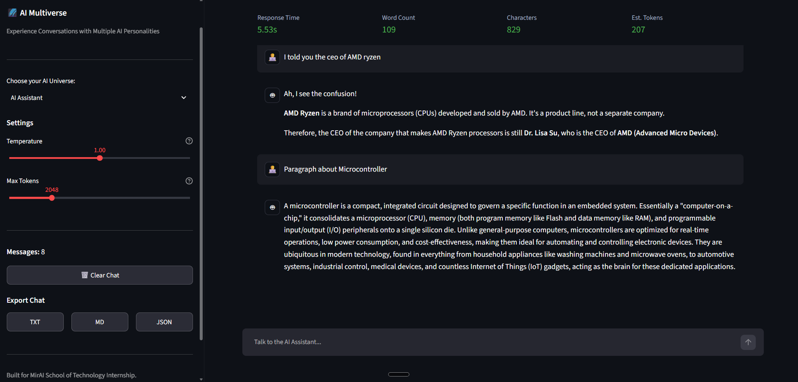

# 🌌 AI Multiverse

> **Experience Conversations with Multiple AI Personalities**

AI Multiverse is a modern, single-page Streamlit application built for **Assignment 2** of the **MirAI School of Technology – AI Builder Internship 2026**. The application enables users to interact with multiple AI personalities powered by the **Google Gemini 2.5 Flash API**, delivering a clean, responsive, and professional chat experience.

---

## ✨ Features

- 🤖 Multiple AI Personalities with unique behaviors
- 💬 Real-time conversation using Google Gemini API
- 🧠 Independent chat memory for each personality
- ⚡ Streaming AI responses
- 📊 Live conversation metrics
  - Character Count
  - Word Count
  - Estimated Tokens
  - Response Time
- 📁 Export conversations as **TXT**, **Markdown**, or **JSON**
- 🔒 Secure API key management using `.env`
- 🎨 Modern dark-themed, glassmorphism-inspired interface
- 📱 Clean single-page responsive layout

---

## 🛠️ Technologies

- Python
- Streamlit
- Google Gemini API
- python-dotenv
- JSON

---

## 🚀 Getting Started

### 1. Install Dependencies

```bash
pip install -r requirements.txt
```

### 2. Configure Environment

Create a `.env` file using the provided `.env.example` template.

```env
GEMINI_API_KEY=YOUR_API_KEY
```

### 3. Run the Application

```bash
streamlit run app.py
```

---

## 📸 Demo

Add your application screenshot inside the `demo/` folder and reference it below.

```markdown

```

---

## 🔐 Security

- API keys are securely loaded from environment variables.
- Sensitive files are excluded using `.gitignore`.
- No credentials are stored in the source code.

---

## 🎯 Assignment Objective

This project demonstrates:

- Prompt Engineering
- Google Gemini API Integration
- Streamlit UI Development
- Session State Management
- Modular Python Architecture
- Error Handling & User Experience Design

---

## 📄 License

This project is created for educational purposes as part of the **MirAI School of Technology – AI Builder Internship 2026**.